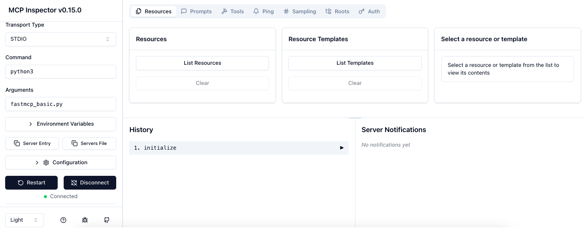
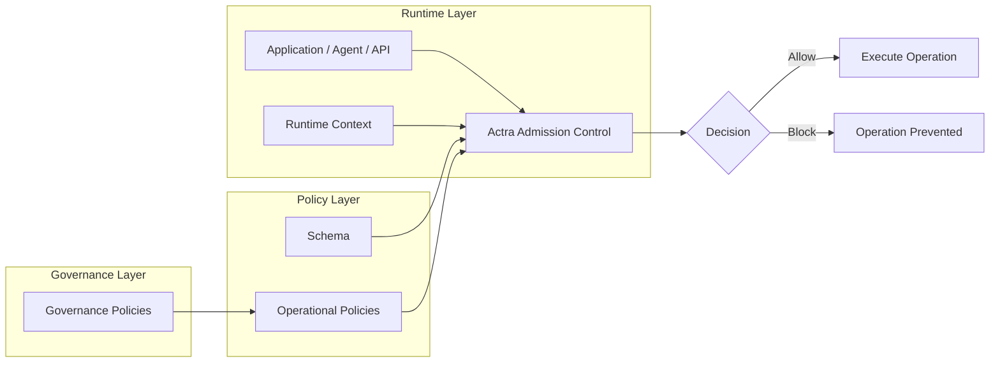

# Actra
### Control what runs before it runs

[](https://pypi.org/project/actra/)
[](https://pypi.org/project/actra/)
[](https://www.npmjs.com/package/@getactra/actra)
[](https://www.npmjs.com/package/@getactra/actra)
[](https://www.npmjs.com/package/@getactra/actra)
[](https://webassembly.org/)
[](https://vercel.com/docs/functions/edge-functions)
[](https://bundlephobia.com/package/@getactra/actra)
[]()
[](https://nodejs.org/)
[](https://deno.land/)
[](https://bun.sh/)
[]()
[](https://workers.cloudflare.com/)
[](https://vercel.com/)
[](https://github.com/getactra/actra/blob/main/LICENSE)

**Admission Control for Agentic and Automated Systems**


Actra introduces **Decision Control** — a runtime layer that evaluates policies **before operations execute**.

It allows systems to **permit or block actions safely**, preventing unsafe operations triggered by AI agents, APIs & automation systems

Instead of embedding control logic directly in application code, Actra evaluates **external policies** before state-changing actions run.

## Where Actra applies

Actra protects operations in systems such as:

- AI agents
- APIs and services
- automation pipelines
- background workers
- workflows and schedulers

### Runs Everywhere
#### SDKs
Python • JavaScript • CLI

**Server**: Node • Bun • Deno
**Edge**: Cloudflare Workers • AWS Lambda • Vercel Edge • Netlify Edge • Fastly Compute@Edge
**Browser**: Web Browsers
**WASM Runtimes:** Wasmtime • Wasmer

---

## See Actra in Action



## Try in 30 seconds

Run Actra directly in your browser:

👉 https://actra.dev/playground.html

No setup required. Uses the real WASM engine.

### An AI agent attempted to call an MCP tool.

Actra evaluated policy and **blocked the unsafe operation before execution**.

---

## Why Actra?

Modern systems increasingly perform actions automatically:

* AI agents calling tools
* workflow automation
* API integrations
* background jobs

These systems can trigger **powerful state-changing operations**, such as:

* issuing refunds
* deleting resources
* sending payments
* modifying infrastructure

Today these controls often live inside application code:

```python
if amount > 1000:
    raise Exception("Refund too large")
```

This creates problems:

* rules duplicated across services
* difficult to audit behavior
* policy changes require redeploys
* automation becomes risky

Actra moves these decisions into **deterministic external policies evaluated before actions execute**.

---

## 20-Second Example

```python
@actra.admit()
def refund(amount):
    ...
```

The rule lives in policy:

```yaml
rules:
  - id: block_large_refund
    scope:
      action: refund
    when:
      subject:
        domain: action
        field: amount
      operator: greater_than
      value:
        literal: 1000
    effect: block
```

Result:

```markdown
refund(200)   -> allowed  
refund(1500)  -> blocked by policy
```

Actra evaluates the policy **before the function executes** and blocks refunds greater than 1000.

---

## JavaScript Example 


```javascript
import { Actra, ActraRuntime, ActraPolicyError } from "@getactra/actra";

// 1. Schema
const schema = `
version: 1

actions:
  refund:
    fields:
      amount: number

actor:
  fields:
    role: string

snapshot:
  fields:
    fraud_flag: boolean
`;

// 2. Policy
const policyYaml = `
version: 1

rules:
  - id: block_large_refund
    scope:
      action: refund
    when:
      subject:
        domain: action
        field: amount
      operator: greater_than
      value:
        literal: 1000
    effect: block
`;

// 3. Compile
const policy = await Actra.fromStrings(schema, policyYaml);

// 4. Runtime
const runtime = new ActraRuntime(policy);

// 5. Context resolvers
runtime.setActorResolver(() => ({ role: "support" }));
runtime.setSnapshotResolver(() => ({ fraud_flag: false }));

// 6. Protect function
function refund(amount) {
  console.log("Refund executed:", amount);
}

const protectedRefund = runtime.admit("refund", refund);

// 7. Execute
await protectedRefund(200); // allowed

try {
  await protectedRefund(1500); // blocked
} catch (e) {
  if (e instanceof ActraPolicyError) {
    console.log("Blocked by policy:", e.matchedRule);
  }
}
```

## Python Example 

```python
from actra import Actra, ActraPolicyError
from actra.runtime import ActraRuntime

schema = """..."""
policy_yaml = """..."""

policy = Actra.from_strings(schema, policy_yaml)
runtime = ActraRuntime(policy)

runtime.set_actor_resolver(lambda ctx: {"role": "support"})
runtime.set_snapshot_resolver(lambda ctx: {"fraud_flag": False})

@runtime.admit()
def refund(amount: int):
    print("Refund executed:", amount)

refund(200)

try:
    refund(1500)
except ActraPolicyError as e:
    print("Blocked by policy:", e.matched_rule)
```

## Key Concepts

Actra evaluates policies using a small set of core concepts.

**Action**  
The operation being requested.  
Example: `refund`, `delete_user`, `deploy_service`.

**Actor**  
The identity performing the action (user, service, or agent).

**Snapshot**  
External system state used during evaluation.  
Example: account status, fraud flags, environment.

**Policy**  
Rules that determine whether an action should be allowed or blocked.

**Governance**  
Optional policies that control how operational policies themselves can be defined or modified.

**Admission Control**  
Actra evaluates policies **before the action executes**, allowing or blocking the operation.

---

## Governance

Actra optionally supports **governance policies**.

Governance policies validate operational policies at compile time,
ensuring that critical safety rules cannot be removed or weakened.

Governance can enforce constraints such as:

* requiring specific safety rules to exist
* preventing unsafe rule patterns
* limiting the number of certain rule types
* restricting which fields policies may reference
* applying constraints only to specific actions

This allows platform or security teams to enforce **organization-wide
policy standards** across services.

Governance policies operate **above normal admission policies**,
providing a control layer that validates policies themselves before
they are accepted.

## Installation Python

```bash
pip install actra
```

See the **examples/** directory for quick start examples.

## Installation JavaScript

Install:

```bash
npm install @getactra/actra
```

---

## Architecture

Actra evaluates policies **before operations execute**.



Schema defines the structure of actions, actors, and snapshots used during policy evaluation.

---

## Example Use Cases

Actra can control many automated operations.

### AI Agents

* restrict tool execution
* prevent critical infrastructure changes
* enforce safety policies

### APIs

* block large refunds
* prevent destructive operations
* enforce safety checks

### Automation

* enforce workflow rules
* restrict financial operations
* require approval thresholds

### Infrastructure

* prevent destructive changes
* enforce safe deployment policies

---

## Actra Platform Support

Actra runs across **server, edge, and browser environments**.

### SDKs and Engines.

| SDK/Engine              |  Status    |
| ---------------------- | ------------------- | 
| Rust Core Engine       | Available (Publishing Pending) |
| Python SDK             | Available |
| JavaScript Runtime SDK | Available       |
| JavaScript Browser SDK | Available     |
| Go SDK                 | Planned |

### JavaScript Runtime Compatibility

| Runtime            | Status  |
| ------------------ | --------|
| Node.js            | Available |
| Bun                | Available |
| Cloudflare Workers | Available |
| AWS Lambda         | Available |
| Web Browsers       | Available |
| Deno                   | Available |
| Fastly Compute@Edge    | Available |
| Vercel Edge Runtime    | Available |
| Netlify Edge Functions | Available |

### Native WebAssembly Runtime Targets

| Runtime  | Status  |
| -------- | ------- |
| Wasmtime | Planned |
| Wasmer   | Planned |


---

## Actra vs OPA vs Cedar

| Feature | Actra | OPA | Cedar |
|-------|------|-----|------|
| Primary purpose | Decision control for operations | General policy engine | Authorization policy language |
| Evaluation timing | **Before executing actions** | Usually request-time decisions | Authorization decisions |
| Integration model | Function / action enforcement | API / sidecar / middleware | Service authorization |
| Policy style | Structured YAML rules | Rego language | Cedar language |
| Governance support | **Built-in policy governance** | External tooling | Limited |
| Determinism focus | Strong | Moderate | Strong |
| Target systems | Agents, automation, APIs | Infrastructure, Kubernetes | Application authorization |
| Typical use case | Control automated operations | Policy enforcement in infra | Access control |

### Positioning

Actra focuses on **controlling actions before they execute**, especially in automated or agent-driven systems.

OPA and Cedar focus primarily on **authorization decisions**, such as:

* “Can user X access resource Y?”

Actra focuses on **admission control for mutations**, such as:

* Should this refund execute?
* Should an agent run this tool?
* Should this workflow step proceed?

Actra also supports **governance policies**, which validate operational policies at compile time to ensure safety rules cannot be removed or weakened.

### Example Scenarios

| Scenario | Best Tool |
|--------|----------|
| Can a user access a document? | Cedar |
| Can a service access an API? | OPA |
| Should an automated system execute an operation? | Actra |
| Should policies themselves follow safety standards? | Actra |


---

## Documentation

Full documentation available at https://docs.actra.dev

---

## License

Apache 2.0
