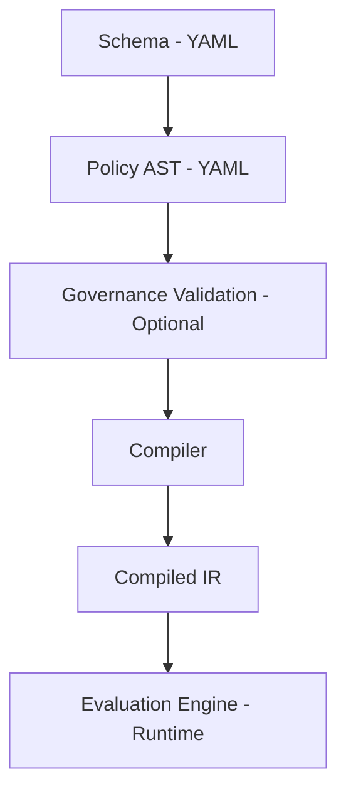

# ActionGate

Deterministic admission control engine for state-changing operations in automated and agentic systems.

ActionGate compiles declarative policy definitions into a validated,
immutable intermediate representation (IR) that can be evaluated
efficiently against runtime inputs.

It is designed for systems that require explicit, reproducible control
over mutations - including API gateways, background workers,
agentic runtimes and automated service workflows.

---

## Why ActionGate?

Modern systems often mix:

- Business logic
- Authorization logic
- Governance rules
- Operational constraints

This leads to implicit, scattered mutation controls.

ActionGate separates these concerns:

1. **Schema** defines allowed structure.
2. **Policy** defines decision logic.
3. **Governance** defines organizational constraints.
4. **Compiler** validates everything upfront.
5. **Engine** performs deterministic evaluation at runtime.

All semantic validation happens at compile time.
Runtime evaluation performs no structural checks.

---

## Core Design Principles

- Deterministic evaluation
- Strict compile-time validation
- First-match-wins rule semantics
- Default allow (unless explicitly blocked)
- No unsafe Rust
- Runtime-agnostic core

---

## Applicable Systems

ActionGate is designed for systems that perform controlled mutations, including:

- Agentic AI runtimes
- Tool-executing LLM systems
- Automation pipelines
- Workflow engines
- API gateways
- State mutation services

It is particularly relevant for:
- Agent frameworks such as OpenClaw
- Systems implementing the Model Context Protocol (MCP)
- Automated remediation systems
- Infrastructure orchestration engines

In these environments, LLMs or automated processes may attempt
state-changing operations. ActionGate provides a deterministic,
compile-time validated control layer in front of those mutations.

It does not replace orchestration logic or workflow execution.
It acts as an explicit mutation admission boundary between
decision-making systems and state-changing operations.

Typical embedding points include:

- Agent execution runtimes
- Tool invocation layers
- MCP-based tool servers
- Background automation workers
- API request pipelines

---

## Example (Node.js)

```js
const { ActionGate } = require('./index')

const schema = `
version: 1
actions:
  delete_user:
    fields:
      type: string
      user_id: string
actor:
  fields:
    role: string
snapshot:
  fields:
    account_tier: string
`

const policy = `
version: 1
rules:
  - id: block_non_admin_delete
    scope:
      action: delete_user
    when:
      subject:
        domain: actor
        field: role
      operator: equals
      value:
        literal: "admin"
    effect: block
`

const gate = new ActionGate(schema, policy)

const result = gate.evaluate({
  action: { type: "delete_user", user_id: "123" },
  actor: { role: "user" },
  snapshot: {}
})

console.log(result)
// { effect: "allow", matched_rule: "" }
```

## Example (Python)

```python
from actiongate import ActionGate

schema = """
version: 1
actions:
  update_account:
    fields:
      type: string
      account_id: string
actor:
  fields:
    role: string
snapshot:
  fields:
    region: string
"""

policy = """
version: 1
rules:
  - id: block_non_admin
    scope:
      action: update_account
    when:
      subject:
        domain: actor
        field: role
      operator: equals
      value:
        literal: "admin"
    effect: block
"""

gate = ActionGate(schema, policy)

result = gate.evaluate({
    "action": {"type": "update_account", "account_id": "A1"},
    "actor": {"role": "user"},
    "snapshot": {}
})

print(result)
```

## Governance Layer

ActionGate includes an optional governance DSL that allows higher-order constraints on policies:

- Require certain rules to exist
- Restrict allowed fields
- Limit rule counts
- Forbid specific patterns

Governance validation runs before compilation and can reject otherwise valid policies.

Architecture



The evaluation engine operates only on validated IR.
No dynamic validation occurs at runtime.

## Status

ActionGate is currently in early foundation stage (v0.1.x).

Core architecture is stable.
Public API may evolve as the DSL matures.

## License
This project is licensed under the Apache License 2.0 - see the LICENSE file for details.