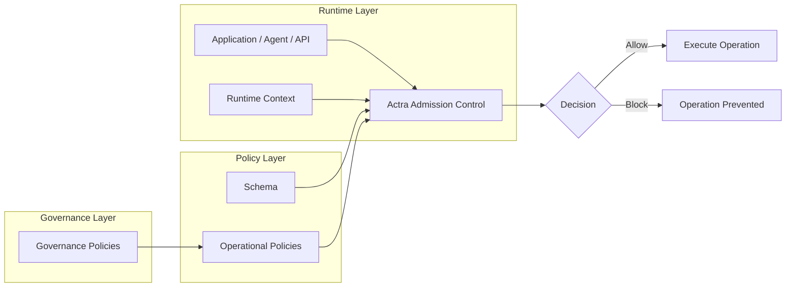

[](https://pypi.org/project/actra/)
[](https://pypi.org/project/actra/)
[](https://github.com/getactra/actra/blob/main/LICENSE)

# Actra
Decision Control

**Admission Control for Agentic & Automated Systems**

Evaluate decisions before operations execute. 
Prevent unsafe actions and enforce safe policies across APIs, services, automation pipelines, and AI agents.

Actra evaluates policies **before operations execute**, allowing or blocking actions triggered by APIs, automation systems, or AI agents.


Actra prevents unsafe operations in:

* AI agents
* APIs
* automation systems
* background workers
* workflows

Instead of embedding control logic in application code, Actra evaluates **external policies** before state-changing actions run.

---

## See Actra in Action


An AI agent attempted to call an MCP tool.

Actra evaluated policy and **blocked the unsafe operation before execution**.

---

## Why Actra?

Modern systems increasingly perform actions automatically:

* AI agents calling tools
* workflow automation
* API integrations
* background jobs

These systems can trigger **powerful state-changing operations**, such as:

* issuing refunds
* deleting resources
* sending payments
* modifying infrastructure

Today these controls often live inside application code:

```python
if amount > 1000:
    raise Exception("Refund too large")
```

This creates problems:

* rules duplicated across services
* difficult to audit behavior
* policy changes require redeploys
* automation becomes risky

Actra moves these decisions into **deterministic external policies evaluated before actions execute**.

---

## 20-Second Example

```python
@actra.admit()
def refund(amount):
    ...
```

The rule lives in policy:

```yaml
rules:
  - id: block_large_refund
    scope:
      action: refund
    when:
      subject:
        domain: action
        field: amount
      operator: greater_than
      value:
        literal: 1000
    effect: block
```

Result:

```markdown
refund(200)   -> allowed  
refund(1500)  -> blocked by policy
```

Actra evaluates the policy **before the function executes** and blocks refunds greater than 1000.

---

## Key Concepts

Actra evaluates policies using a small set of core concepts.

**Action**  
The operation being requested.  
Example: `refund`, `delete_user`, `deploy_service`.

**Actor**  
The identity performing the action (user, service, or agent).

**Snapshot**  
External system state used during evaluation.  
Example: account status, fraud flags, environment.

**Policy**  
Rules that determine whether an action should be allowed or blocked.

**Governance**  
Optional policies that control how operational policies themselves can be defined or modified.

**Admission Control**  
Actra evaluates policies **before the action executes**, allowing or blocking the operation.

---

## Governance

Actra optionally supports **governance policies**.

Governance policies validate operational policies at compile time,
ensuring that critical safety rules cannot be removed or weakened.

Governance can enforce constraints such as:

* requiring specific safety rules to exist
* preventing unsafe rule patterns
* limiting the number of certain rule types
* restricting which fields policies may reference
* applying constraints only to specific actions

This allows platform or security teams to enforce **organization-wide
policy standards** across services.

Governance policies operate **above normal admission policies**,
providing a control layer that validates policies themselves before
they are accepted.

## Installation

```bash
pip install actra
```

See the **examples/** directory for quick start examples.

---

## Architecture

Actra evaluates policies **before operations execute**.



Schema defines the structure of actions, actors, and snapshots used during policy evaluation.

---

## Example Use Cases

Actra can control many automated operations.

### AI Agents

* restrict tool execution
* prevent critical infrastructure changes
* enforce safety policies

### APIs

* block large refunds
* prevent destructive operations
* enforce safety checks

### Automation

* enforce workflow rules
* restrict financial operations
* require approval thresholds

### Infrastructure

* prevent destructive changes
* enforce safe deployment policies

---

## SDKs

Actra supports multiple runtimes.

| Runtime | Status       |
| ------- | ------------ |
| Python  | Available    |
| Node.js | WIP          |
| Rust    | Core runtime |
| WASM    | Planned      |
| Go      | Planned      |

---

## Actra vs OPA vs Cedar

| Feature | Actra | OPA | Cedar |
|-------|------|-----|------|
| Primary purpose | Decision control for operations | General policy engine | Authorization policy language |
| Evaluation timing | **Before executing actions** | Usually request-time decisions | Authorization decisions |
| Integration model | Function / action enforcement | API / sidecar / middleware | Service authorization |
| Policy style | Structured YAML rules | Rego language | Cedar language |
| Governance support | **Built-in policy governance** | External tooling | Limited |
| Determinism focus | Strong | Moderate | Strong |
| Target systems | Agents, automation, APIs | Infrastructure, Kubernetes | Application authorization |
| Typical use case | Control automated operations | Policy enforcement in infra | Access control |

### Positioning

Actra focuses on **controlling actions before they execute**, especially in automated or agent-driven systems.

OPA and Cedar focus primarily on **authorization decisions**, such as:

* “Can user X access resource Y?”

Actra focuses on **admission control for mutations**, such as:

* Should this refund execute?
* Should an agent run this tool?
* Should this workflow step proceed?

Actra also supports **governance policies**, which validate operational policies at compile time to ensure safety rules cannot be removed or weakened.

### Example Scenarios

| Scenario | Best Tool |
|--------|----------|
| Can a user access a document? | Cedar |
| Can a service access an API? | OPA |
| Should an automated system execute an operation? | Actra |
| Should policies themselves follow safety standards? | Actra |


---

## Documentation

Full documentation coming soon.

Refer to the **examples** folder for detailed usage examples.

Planned documentation sections:

* policy language
* MCP integration
* agent safety
* runtime architecture
* advanced policy patterns

---

## License

Apache 2.0
