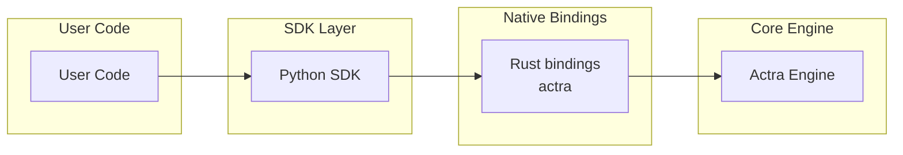

# Actra Python SDK

**Action Admission Control for Automated Systems**

Deterministic policy engine that decides whether automated actions are **allowed before they execute**.

The **Actra Python SDK** provides a simple interface for loading policies and evaluating decisions using the Actra engine written in Rust.

---

## Runtime Admission Control

The SDK also provides a runtime layer for protecting functions using Actra policies.

If a policy blocks the operation, the function will not execute and a
PermissionError will be raised.

---

## Installation

Install from PyPI:

```bash
pip install actra
```

The package includes a compiled Rust engine, so no Rust toolchain is required during installation.

---

## Quick Start

```python
@actra.admit()
def refund(amount):
    ...
```

The rule lives in policy:

```yaml
rules:
  - id: block_large_refund
    when:
      subject:
        domain: action
        field: amount
      operator: greater_than
      value:
        literal: 1000
    effect: block
```

```markdown
Result:

refund(200)   > allowed  
refund(1500)  > blocked by policy
```

Actra evaluates the policy **before the function executes** and blocks refunds greater than 1000.

---


## Design Goals

The Python SDK focuses on:

* simple developer ergonomics
* deterministic policy evaluation
* minimal runtime overhead
* seamless integration with the Rust engine

The heavy lifting is performed by the core engine, ensuring fast and consistent evaluations.

---

## Architecture



The SDK provides a Python-friendly interface while the core engine handles compilation and evaluation.

---

## License

Apache License 2.0

---

## Project

Actra is designed for systems requiring explicit, reproducible control over state-changing operations in automated environments.
