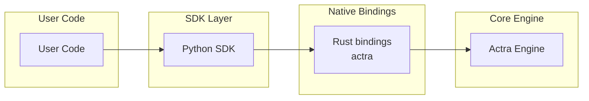

# Actra Python SDK

Deterministic admission control for state-changing operations in automated and agentic systems.

The **Actra Python SDK** provides a simple interface for loading policies and evaluating decisions using the Actra engine written in Rust.

---

## Installation

Install from PyPI:

```bash
pip install actra
```

The package includes a compiled Rust engine, so no Rust toolchain is required during installation.

---

## Quick Start

```python
import actra

policy = actra.load_policy_from_file(
    "schema.yaml",
    "policy.yaml"
)

decision = policy.evaluate({
    "action": {"type": "deploy"},
    "actor": {"role": "admin"},
    "snapshot": {}
})

print(decision)
```

---

## Loading Policies

### From Files

```python
import actra

policy = actra.load_policy_from_file(
    "schema.yaml",
    "policy.yaml"
)
```

Optional governance configuration can also be provided:

```python
policy = actra.load_policy_from_file(
    "schema.yaml",
    "policy.yaml",
    "governance.yaml"
)
```

---

### From Strings

Useful for tests or dynamic environments.

```python
policy = actra.load_policy_from_string(
    schema_yaml,
    policy_yaml
)
```

---

## Evaluating Decisions

Policies evaluate a request context.

```python
decision = policy.evaluate({
    "action": {...},
    "actor": {...},
    "snapshot": {...}
})
```

The context typically contains:

| Field      | Description                  |
| ---------- | ---------------------------- |
| `action`   | operation being requested    |
| `actor`    | entity requesting the action |
| `snapshot` | current system state         |

---

## Policy Hash

Every compiled policy has a deterministic hash.

```python
policy.policy_hash()
```

This is useful for:

* auditing
* verifying policy consistency

---

## Engine Version

Retrieve the underlying compiler version:

```python
import actra

actra.Actra.compiler_version()
```

---

## Example

```python
import actra

policy = actra.load_policy_from_file(
    "schema.yaml",
    "policy.yaml"
)

request = {
    "action": {"type": "deploy"},
    "actor": {"role": "developer"},
    "snapshot": {}
}

decision = policy.evaluate(request)

print("Decision:", decision)
```

---

## Design Goals

The Python SDK focuses on:

* simple developer ergonomics
* deterministic policy evaluation
* minimal runtime overhead
* seamless integration with the Rust engine

The heavy lifting is performed by the core engine, ensuring fast and consistent evaluations.

---

## Architecture



The SDK provides a Python-friendly interface while the core engine handles compilation and evaluation.

---

## License

Apache License 2.0

---

## Project

Actra is designed for systems requiring explicit, reproducible control over state-changing operations in automated environments.
